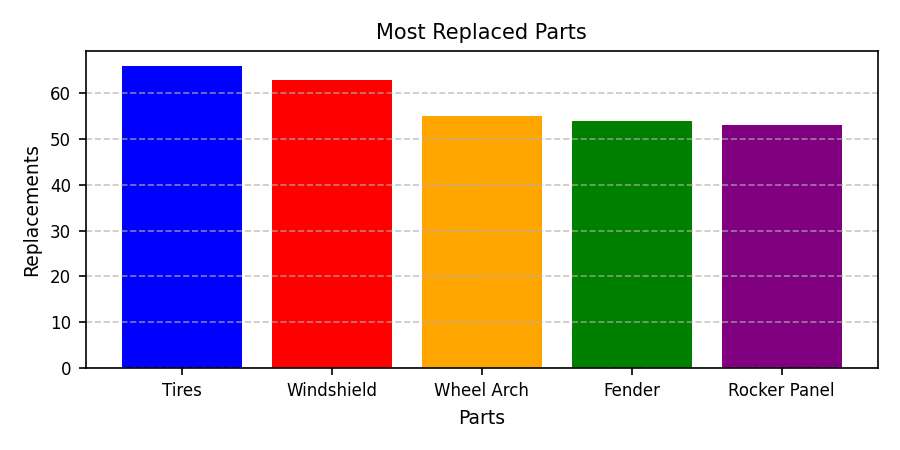
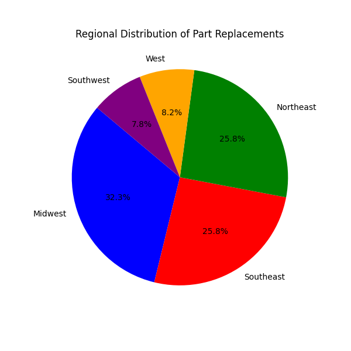
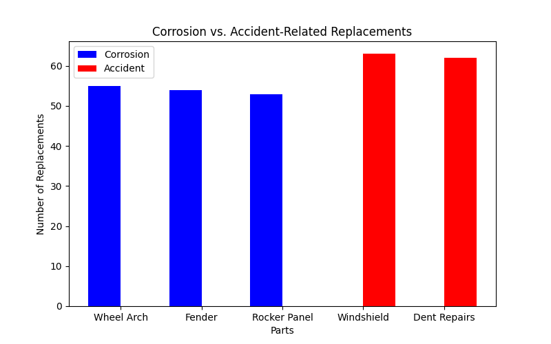

# N Roberts
# DAD 220: Fleet Maintenance Visualization Project

## 📊 Project Overview

This project focuses on visualizing key trends in fleet vehicle part replacements, aimed at communicating actionable insights to stakeholders. The data analysis highlights which vehicle parts are most frequently replaced, regional patterns in maintenance needs, and the causes of part replacements (corrosion vs. accidents).

---

## 📌 Visualizations Included

### 1. Most Replaced Parts

This bar chart visualizes the top five most commonly replaced vehicle parts across the fleet:

- **Tires**
- **Windshield**
- **Wheel Arch**
- **Fender**
- **Rocker Panel**

This visualization helps identify which components may require stronger materials, more frequent inspections, or supplier renegotiations.

<p align="center">
  
</p>

---

### 2. Regional Distribution of Part Replacements

A pie chart showing the geographic breakdown of where part replacements are most frequent. This aids in regional logistics planning and may indicate varying driving conditions or usage patterns:

- **Midwest**
- **Southeast**
- **Northeast**
- **West**
- **Southwest**

<p align="center">
  
</p>

---

### 3. Corrosion vs. Accident-Related Replacements

This grouped bar chart distinguishes between parts replaced due to corrosion and those due to accidents. 

- **Corrosion-related**: Common in areas with harsh weather or poor road conditions.
- **Accident-related**: Indicates damage-prone components that may benefit from design or policy improvements.

<p align="center">
  
</p>

---

## ✅ Tools Used

- Python 3
- `matplotlib` for data visualization
- `numpy` for numerical processing

---

## 📈 Insights for Stakeholders

- **Operational Efficiency**: Understanding which parts fail most can drive preventative maintenance strategies.
- **Budget Planning**: High replacement rates indicate areas for improved forecasting or supplier evaluation.
- **Safety Improvements**: Accident-related data supports targeted safety and design adjustments.

---

## 🚀 Getting Started

1. Clone this repository:
   ```bash
   git clone https://github.com/ninirob/fleet-maintenance-DAD220.git
   
